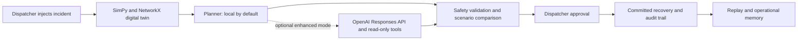
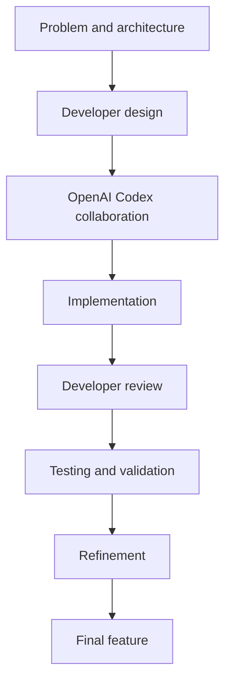

# NEXUS AI: Decision Intelligence Platform for Critical Infrastructure

## Judge quickstart

NEXUS AI is a human-in-the-loop operating system for railway disruption recovery. It couples a SimPy digital twin with NetworkX routing, deterministic safety rules, replayable evidence, and a dispatcher approval gate.



### What to demonstrate

1. Select **Inject Incident**, then choose cascading incident or network partition.
2. Generate and validate the typed recovery plan; compare confidence, risks, alternatives, timeline, and predicted metrics.
3. Approve and commit the recommendation. The simulation resumes only after that dispatcher action.
4. Load the replay timeline and show the durable decision trail.

For the complete workflow and safety sequence, see [the architecture guide](docs/architecture.md) and [the judge demo guide](docs/judge-demo.md).

### Planner modes

| Mode | Behavior |
| --- | --- |
| local | Default. Fully deterministic, offline rule engine. |
| auto | Uses enhanced planning only when configured; otherwise local. |
| enhanced | Attempts the OpenAI Responses API, then safely falls back to local on any error. |

Enhanced mode is server-side only, uses structured outputs and a strict read-only tool allowlist, has timeout/retry boundaries, and is always checked by local validation before a dispatcher can approve it.

NEXUS AI is an **AI-native decision intelligence platform and digital twin** designed to orchestrate critical infrastructure systems under disruption. While demonstrated here on a high-speed rail corridor (the Mumbai-Ahmedabad High-Speed Rail Corridor), the underlying architecture is built to scale across maritime ports, smart energy grids, and airport logistics.

Rather than relying on static centralized solvers, NEXUS AI combines **decentralized multi-agent simulation (SimPy)**, **graph topology pathfinding (NetworkX)**, and a deterministic local recovery engine to help human operators evaluate network blockages, negotiate track usage, and execute verified recovery plans.

## OpenAI Build Week 2026 submission

NEXUS is a human-in-the-loop rail operations AI system. A dispatcher injects a disruption, evaluates sandboxed alternatives, requests a typed recovery plan, validates it, explicitly approves it, and commits it with a durable audit trail.

# 🚀 AI-Assisted Engineering with OpenAI Codex

OpenAI Codex was used as an AI software-engineering collaborator throughout the NEXUS development lifecycle. It accelerated iterative implementation, code review, debugging, testing, and documentation work while the project owner retained responsibility for architecture, product direction, integration decisions, review, and final validation.

## How Codex Accelerated Development

Codex assisted with backend architecture refinement, FastAPI endpoint work, React and TypeScript improvements, complex-module refactoring, error handling, API-contract checks, unit and integration tests, performance and security reviews, edge-case discovery, documentation, README updates, and CI quality gates. Every suggestion was reviewed, adjusted where needed, tested, and validated before integration.



| Engineering Area | Role of OpenAI Codex | Human Validation |
| --- | --- | --- |
| Backend architecture | Reviewed module boundaries and dependencies | Architecture decisions remained developer-owned |
| FastAPI APIs | Accelerated endpoint and schema implementation | Contracts and error behavior were tested |
| React UI | Helped refine cockpit panels and state flows | UX choices were reviewed in-browser |
| TypeScript | Identified typing and build issues | Lint and production builds verified changes |
| Planner | Assisted with local fallback and enhanced-mode integration | Deterministic validation retained final authority |
| Tool registry | Helped maintain a strict approved-tool surface | Only read-only approved tools were accepted |
| Debugging | Investigated lifecycle, rendering, and test failures | Fixes were reproduced and retested |
| Testing | Expanded unit, contract, and Playwright coverage | Test results gated integration |
| Security | Flagged payload, header, auth, and validation gaps | Safeguards were implemented and reviewed |
| Performance | Identified lazy-loading and rendering opportunities | Build output and browser flows were checked |
| Documentation | Drafted architecture, runbook, and demo materials | Project claims were reviewed for accuracy |
| CI workflow | Helped keep tests, lint, build, and browser checks aligned | Workflow remained developer-controlled |

## Engineering Workflow

Development followed an iterative AI-assisted workflow: planning, implementation, refactoring, testing, validation, optimization, documentation, and continuous repository-wide review. Codex shortened feedback loops across those stages; it did not independently define product requirements or merge unreviewed work.

## Why OpenAI Codex Matters

Codex was used as an engineering collaborator rather than an autonomous developer. It increased engineering productivity across implementation, debugging, refactoring, testing, documentation, and code review while the developer remained responsible for every architectural decision and final code integration.

> [!TIP]
> 💡 OpenAI Codex accelerated software engineering across the development lifecycle—from implementation and debugging to testing, documentation, and continuous code review—while critical engineering decisions remained under human supervision.

### AI architecture

`Planner → allowlisted MCP tools → sandbox comparison → validation/self-reflection → dispatcher approval → committed replay event`

The planner defaults to a fully local, deterministic Rule-Based Recovery Engine. It needs no API key, model download, external service, or network connection. An optional OpenAI Responses API enhancement can be selected with `PLANNER_MODE=auto` or `PLANNER_MODE=enhanced`; it is strictly tool-allowlisted, validated, and automatically falls back to the local engine on any provider failure.

### Repository layout

| Path | Responsibility |
| --- | --- |
| `backend/agents` | Planner, development planner, validation, event orchestration |
| `backend/mcp_registry` | Read-only NetworkX/SimPy tool allowlist |
| `backend/simulation` | SimPy digital twin, schemas, topology, safety modelling |
| `backend/services` | Rule-based planner, SQLite persistence, audit, authentication |
| `frontend/src` | React dispatcher control room and MapLibre visualisation |
| `.github/workflows` | Backend, frontend, build, and browser quality gates |

### Environment variables

Copy `backend/.env.example` and `frontend/.env.example`; never commit real values.

| Variable | Purpose |
| --- | --- |
| `NEXUS_AUTH_REQUIRED`, `NEXUS_DISPATCHER_TOKEN` | Production dispatcher authorization |
| `NEXUS_CORS_ORIGINS` | Exact allowed frontend origins |
| `VITE_API_BASE_URL` | Render backend URL used by the Vercel frontend build |
| `PLANNER_MODE` | `local` (default), `auto`, or `enhanced` |
| `OPENAI_API_KEY`, `OPENAI_MODEL` | Optional server-side enhanced planner configuration |

### Deployment

**Render backend:** use [`render.yaml`](render.yaml) to create the service, configure the backend environment variables above, and use `/healthz` as the health check. GZip compression is enabled for larger responses. Persist `backend/data/nexus.db` on durable storage.

**Vercel frontend:** set the project root/build configuration from `vercel.json`, then set `VITE_API_BASE_URL` to the HTTPS Render URL. Add that Vercel URL to `NEXUS_CORS_ORIGINS` on Render.

### Demo script

1. Open the cockpit and point out the Planner Mode badge.
2. Inject a preset disruption, inspect the decision matrix, evidence, confidence, and “Why not?” response.
3. Generate and validate a plan; stream planner/tool/validation events in the log panel.
4. Approve the validated recommendation, commit it, and show the audit/replay timeline.
5. Use replay pause, resume, and seek to revisit the decision point.

### Verification

```bash
# backend, repository root
PYTHONPATH=backend python -m unittest mcp_registry.test_registry agents.test_validator agents.test_events services.test_planner_engine services.test_database services.test_plan_store services.test_recovery_memory scenarios.test_presets test_api_contract test_planner_api simulation.test_schemas

# frontend
cd frontend && npm test && npm run build && npm run test:e2e
```

Codex accelerated the integration, test coverage, CI quality gates, typed lifecycle workflow, deployment configuration, and operational documentation. The full runbook is in [`docs/operations.md`](docs/operations.md).

---

## 🚀 Key Highlights & Innovation

* **Hierarchical AI Orchestration**: Exposes a multi-agent routing loop where a **Planner Agent** delegates analysis to specialized sub-agents (**Recovery**, **Risk**, **Passenger**, **Energy**) and passes the proposed action plan to a **Validation Agent** for self-reflection and constraint verification.
* **Game-Theoretic Platform Auctions**: Platforms are managed as finite resources. During conflicts, Train Agents calculate dynamic bids based on passenger loads and delays to participate in a **Vickrey-Clarke-Groves (VCG) second-price auction** for platform slot allocation.
* **Physical Twin Integrity**: Models catenary current draw, distance-based line resistance, and catenary voltage drop. Tripping a track substation circuit breaker limits speeds to a safe 50 km/h crawl.
* **Three-Way Scenario Comparison**: Runs sandboxed Monte Carlo clones of the simulation in the backend to evaluate and plot trade-offs for three strategies: *Do Nothing*, *Detour Rerouting*, and *Short-Turning*.
* **Interactive Dispatcher UI**: Built with dark-mode glassmorphic panels, CartoDB dark-matter GIS maps using MapLibre GL, streaming reasoning execution logs, and low-latency synthesized programmatic sound effects (Web Audio API).

---

## 🏛️ System Architecture

```
                  ┌─────────────────────────────────┐
                  │      Dispatcher Dashboard       │
                  └───────────────┬─────────────────┘
                                  │
                                  ▼
                     ┌──────────────────────────┐
                     │   Planner Agent (AI)     │
                     └────────────┬─────────────┘
                                  │
         ┌────────────────────────┼────────────────────────┐
         ▼                        ▼                        ▼
  [Recovery Agent]          [Risk Agent]           [Energy Agent]
 (Detour Dijkstra)        (Roster Compliance)     (Voltage Drop)
         │                        │                        │
         └────────────────────────┼────────────────────────┘
                                  │
                                  ▼
                     ┌──────────────────────────┐
                     │   Validation Agent (AI)  │
                     └────────────┬─────────────┘
                                  │ (Self-Reflection Check)
                                  ▼
                   ┌──────────────────────────────┐
                   │    Human-in-the-Loop Approval│
                   └──────────────┬───────────────┘
                                  │
                                  ▼
                   ┌──────────────────────────────┐
                   │    SimPy / NetworkX Engine   │
                   └──────────────────────────────┘
```

---

## 🛠️ Technology Stack

* **Frontend**: React, TypeScript, Vite, Tailwind CSS v4, MapLibre GL JS, Recharts, Lucide Icons.
* **Backend**: FastAPI, Python 3.10+, SimPy (Discrete Event Simulation), NetworkX (Graph Theory).

---

## 🚦 How to Run the System Locally

### Prerequisites
* **Python 3.10+**
* **Node.js 18+**

### 1. Start the FastAPI Simulation Backend
```bash
cd backend
# Create a virtual environment (optional)
python -m venv venv
# Activate the virtual environment:
# Windows: .\venv\Scripts\activate
# macOS/Linux: source venv/bin/activate

pip install -r requirements.txt
python main.py
```
The backend API server will run at `http://127.0.0.1:8000`.

### 2. Start the React Frontend Dashboard
```bash
cd frontend
npm install
npm run dev
```
Open your browser and navigate to `http://localhost:5173`.

### 3. Run Automated Physics & Engine Tests
Verify the simulation agents, VCG auctions, and track safety configurations:
```bash
python backend/simulation/test_simulator.py
```

### Planner API setup (Milestone 1)

The planner is additive: it reads the current simulator through an allowlisted internal tool registry and returns a recommendation. It does **not** alter simulation state or commit a recovery strategy.

No planner-specific environment variables are required.

Request a typed recovery plan with `POST /api/planner`:

```json
{
  "disruption": {
    "id": "DIS-001",
    "edge_id": "MUM->TNA",
    "duration": 30,
    "severity": "HIGH",
    "description": "Track circuit failure"
  },
  "trains": [],
  "stations": []
}
```

The response is a typed `RecoveryPlan` containing a local-rule strategy, actions, reasoning, deterministic confidence, and expected metrics.

Milestone 2 adds planner-accessible sandbox tools for comparing all recovery strategies or simulating one supported strategy. These use cloned SimPy runs and never commit or alter the live simulation.

Validate an uncommitted typed plan with `POST /api/planner/validate`. Validation returns sandbox evidence plus typed findings, and rejects unsupported, illegal, or crew-noncompliant strategies without changing the live simulation.

Run the Milestone 1 tests from the repository root:

```bash
set PYTHONPATH=backend
python -m unittest discover -s backend -p "test_*.py"
```

### Demo walkthrough

1. Inject a disruption or use a curated preset.
2. Compare the decision matrix and inspect scenario evidence.
3. Request a structured planner recommendation, then validate it against the sandbox.
4. Inspect streaming execution logs and use “Why not?” for an alternative.
5. Explicitly approve the selected strategy; only then commit it.
6. Open the replay control to review the disruption, approval, and recovery timeline.

---

## 📊 Mathematical & Physics Modeling

### 1. VCG platform slot auction payment:
$$P_i = \max_{j \neq i} \text{Bid}_j$$
The highest bidder wins the platform slot but pays the second-highest bid price to ensure truthfulness.

### 2. Operational Resilience Score (ORS):
NEXUS calculates a composite resilience score using **Weighted Tchebycheff Distance** to measure normalized delays, energy overhead, and roster violations:
$$ORS = 100 - \max \left( w_d \cdot N_d, w_e \cdot N_e, w_c \cdot N_c \right) \times 65$$

### 3. Catenary Voltage Degradation:
$$V_{\text{actual}} = 25000 - I_{\text{draw}} \times (R_{\text{resistance}} \times d_{\text{distance}})$$
Where traction current draw drops voltage relative to the distance from the nearest substation feed.
