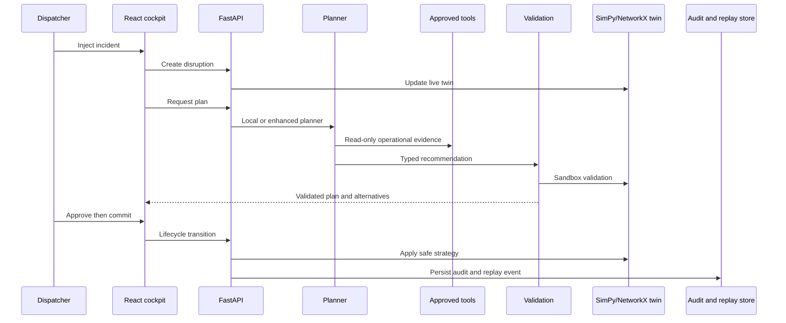

# NEXUS AI architecture

NEXUS is a human-governed railway recovery system. The SimPy and NetworkX digital twin remains the operational source of truth; the planner never commits an action directly.

## Safety boundaries

- The local rule engine is the default and requires no external credential.
- Enhanced mode uses structured Responses API output and an explicit read-only tool allowlist.
- Validation rejects unsupported, ungrounded, illegal, or crew-unsafe plans.
- Dispatcher approval is required before every commit or rollback.
- Replay and audit events are persisted in SQLite.

## Attention Management & Default Behavior Engine

NEXUS AI incorporates a dedicated **Attention Control Engine** to mitigate notification fatigue and reduce cognitive review load:

1. **Cognitive Review Load Index (CRLI)**: Computes a multi-factor score (0-100) combining disruption load, decision queue pressure, spatial train density, neural uncertainty spread, and crew shift expiration warnings.
2. **Dynamic Interruption Triage Matrix**:
   - `QUIET_AUTO_EXECUTE`: Actions with neural confidence ≥85% and zero safety violations auto-execute quietly in background mode.
   - `BATCH_REVIEW`: Routine advisories are quarantined and grouped into 30-second low-interruption review batches.
   - `IMMEDIATE_INTERRUPT`: Critical safety constraint trips or Out-of-Distribution hazards trigger immediate spotlight drawers.
3. **Context-Aware Sensible Parameter Pre-fill**: Recovery action parameters (hold times, platform assignments, detour routes, speed restrictions) are pre-filled automatically using historical dispatcher choices (`RecoveryMemory`) and environmental weather constraints.
4. **100% Editable Controls**: All confidence thresholds, interruption profiles (`LOW`, `BALANCED`, `HIGH`), and pre-filled parameters remain fully editable and customizable by human dispatchers at any time.

