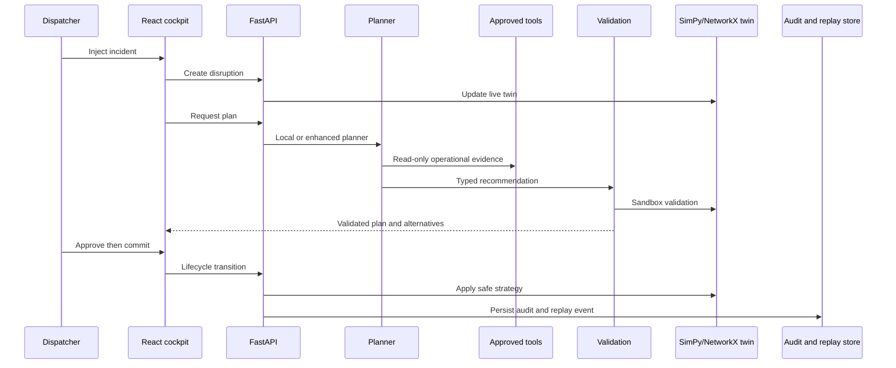

# NEXUS AI architecture

NEXUS is a human-governed railway recovery system. The SimPy and NetworkX digital twin remains the operational source of truth; the planner never commits an action directly.

## Safety boundaries

- The local rule engine is the default and requires no external credential.
- Enhanced mode uses structured Responses API output and an explicit read-only tool allowlist.
- Validation rejects unsupported, ungrounded, illegal, or crew-unsafe plans.
- Dispatcher approval is required before every commit or rollback.
- Replay and audit events are persisted in SQLite.
